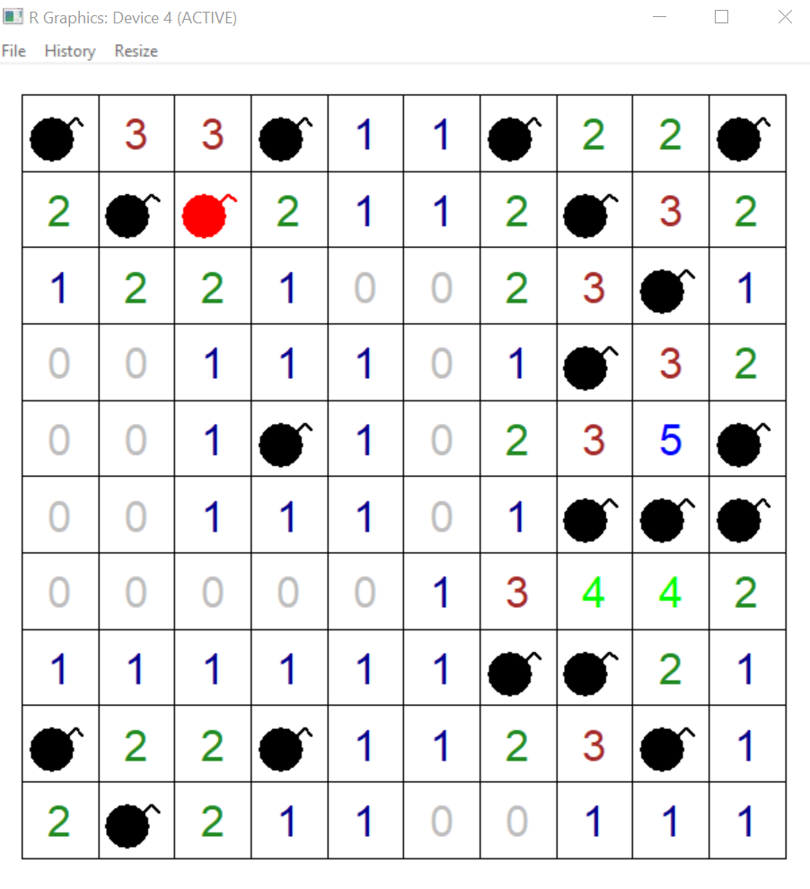
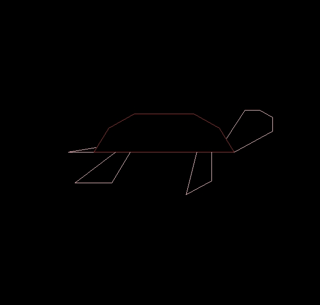

<table><tr><td bgcolor=#D1EEEE>

<div align=center><h1> Welcome to my Homepage!</h1></div>


## Brief Description 
&emsp;&emsp;This repository is for my assignment 1 of [STAT 545](http://stat545.com/Classroom/)
  
- In this repository, you can find:
  * README.md:
    + About me
    + Fun R coding
  * some pictures 
  
  
---
## About me
:smile:

  Hi,I'm Sukey, a second year student in EECE. ***Nice to meet you all~***

### Why I take this course
<div style="text-align: left">  
&emsp;&emsp;During my internship in this summer, I used python for machine learning but some of my colleagues used R, then I think I also need learn something about R for my working skills. So I'm Soooo Glad to take this course.
</div>

### My Hobbies

|    **Hobbies**    |  **rate**  |
|:---:|:---:|
| Movies            | :blush:    |
| Travelling        | :smile:    |
| Cooking           | :laughing: |


---


## Fun R coding
### coding

**This is a R coding to generate a fun pic.**
```R
library(grid)
heart<-function(lcolor)
{
  t<-seq(0,2*pi,by=0.1)
  x<-16*sin(t)^3
  y<-13*cos(t)-5*cos(2*t)-2*cos(3*t)-cos(4*t)
  a<-(x-min(x))/(max(x)-min(x))
  b<-(y-min(y))/(max(y)-min(y))
  grid.lines(a,b,gp=gpar(col=lcolor,lty="solid",lwd=3))
}


grid.newpage()
ang<-15*c(1,rep(0,29))
for(j in 1:30)
{
  vp<-viewport(0.5,0.5,w=0.9,h=0.9,angle=ang[j])
  pushViewport(vp)
  heart("hotpink")
}
ang<--30*c(1,rep(0,29))
vp<-viewport(3.3,-2.9,w=1.09,h=1.09,angle=ang[1],just="bottom")
pushViewport(vp)
heart("red")
for(j in 2:30)
{
  vp<-viewport(0.5,0.5,w=1.09,h=1.09,angle=ang[j])
  pushViewport(vp)
  heart("red")
}
```
### Wanna see the effect?
<div align=center></div>
<div align=center>`Try it and have fun!`</div>

### Other fun coding
**clik the picture and find the code**
<div align=center>
<figure class="half">
     ![game]](http://baidu.com)  
    
</figure>
</div>

### Some useful link for R
1.[RStudio Cheat Sheets](https://www.rstudio.com/resources/cheatsheets/)  
2.[Programming in R](http://manuals.bioinformatics.ucr.edu/home/programming-in-r)  
3.[Keyboard Shortcuts](https://support.rstudio.com/hc/en-us/articles/200711853-Keyboard-Shortcuts)  


# D1EEEE</td></tr></table>
